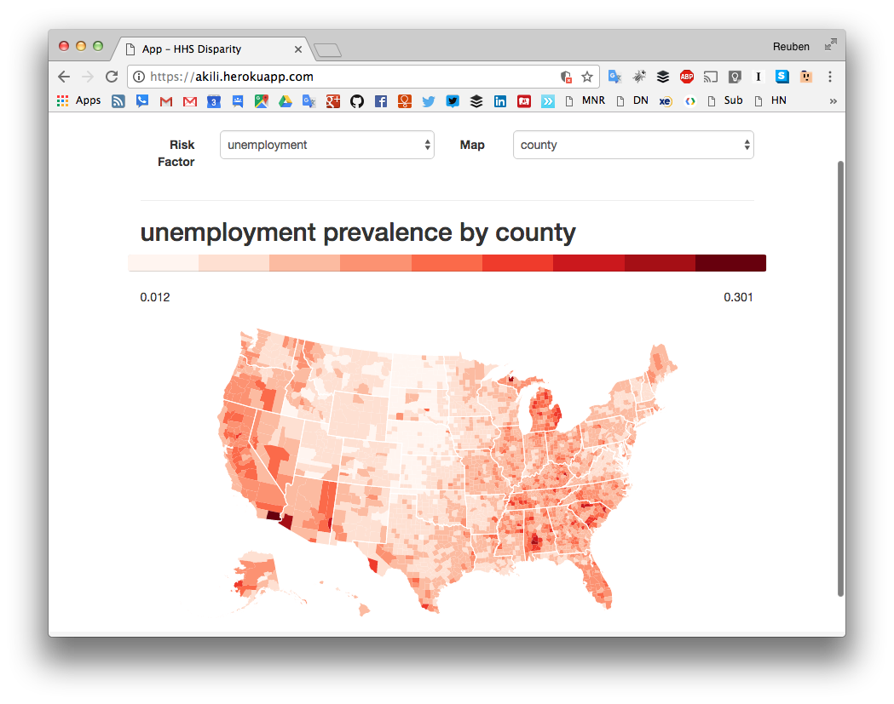

# akili



## Introduction

akili is a [Brunch](http://brunch.io) and [Chaplin](http://chaplinjs.org) web app for creating responsive choropleths.

## Requirements

akili has been tested on the following configuration:

- MacOS X 10.9.5
- Brunch 1.8.5 (required)
- Chaplin 1.0.1 (required)
- [npm](https://www.npmjs.com/) 2.5.0 (required)
- [Bower](http://bower.io) 1.6.3 (required)
- [Coffeescript](http://coffeescript.org/) 1.6.2 (required to run a production server)
- [Node.js](http://nodejs.org) 0.12.5 (required to run a production server)


## Setup

*Install requirements (if you haven't already)*

```bash
npm install -g brunch
npm install -g bower
npm install -g coffee-script
```

## Installation

```bash
brunch new gh:nerevu/akili
cd akili
npm install
bower install
```

## Usage

*Run development server (continuous rebuild mode)*

    brunch watch --server

*Run production node server*

    coffee server.coffee

*Build html/css/js files (will appear in `public/`)*

    brunch build

*Build html and minified css/js files (will appear in `public/`)*

    brunch build --production

## License

akili is distributed under the [MIT License](http://opensource.org/licenses/MIT).
